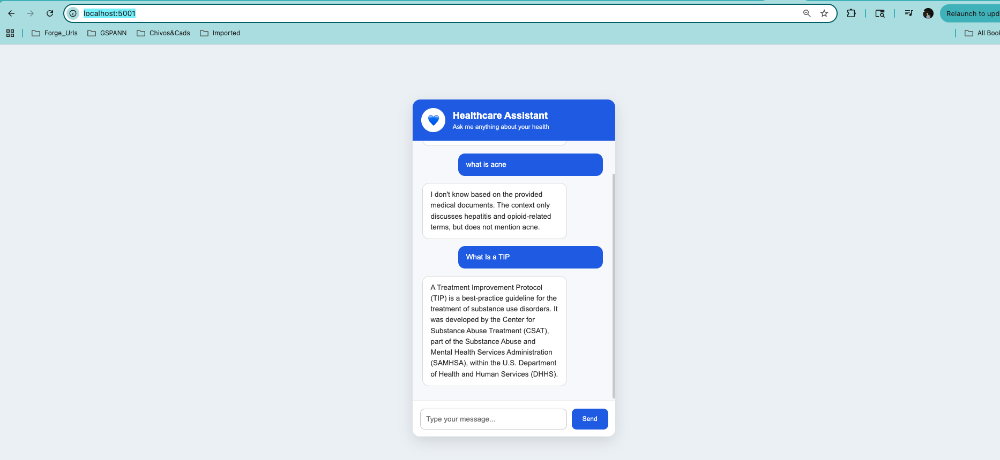

# 🩺 Medical RAG Chatbot using LangChain, Pinecone, Ollama, Flask & AWS

A production-ready **Retrieval-Augmented Generation (RAG)** chatbot that answers medical questions using semantic search, vector databases, reranking, and a local Large Language Model (Llama 3.2 via Ollama).

Unlike a basic RAG application, this project includes **retrieval optimization**, **Cross Encoder reranking**, and an **offline evaluation framework** using **Precision@K** and **Recall@K** to measure retrieval quality.

---

# Demo



---

#  Features

- 📄 Medical PDF ingestion
- 🔍 Semantic Search using Pinecone Vector Database
- ✂️ Recursive Text Chunking
- 🧠 BGE Embeddings (`BAAI/bge-small-en-v1.5`)
- 🎯 Cross Encoder Reranking
- 🤖 Local LLM using Ollama (Llama 3.2)
- 📊 Retrieval Evaluation (Precision@K & Recall@K)
- 📑 Metadata-aware Chunking (Page Number + Chunk ID)
- 🌐 Flask REST API
- 💬 Interactive Chat UI
- 🐳 Docker Support
- ☁️ AWS Deployment (ECR + EC2)
- ⚙️ GitHub Actions CI/CD

---

# 🏗️ System Architecture

```text
                           Medical PDF
                                │
                                ▼
                    PDF Loader (LangChain)
                                │
                                ▼
                    Metadata Optimization
                                │
                                ▼
              Recursive Character Text Splitter
                                │
                                ▼
                  BGE Embedding Generation
                                │
                                ▼
                  Pinecone Vector Database
────────────────────────────────────────────────────────────

                     User Question
                           │
                           ▼
                 Generate Query Embedding
                           │
                           ▼
               Pinecone Retrieval (Top-10)
                           │
                           ▼
              Cross Encoder Reranker (Top-3)
                           │
                           ▼
                  Prompt Template
                           │
                           ▼
              Llama 3.2 (Ollama Local LLM)
                           │
                           ▼
                  Grounded Medical Answer
```

---

# 📂 Project Structure

```text
MedicalAPP/
│
├── app.py
├── store_index.py
├── inspect_chunks.py
├── Dockerfile
├── requirements.txt
├── README.md
├── .env
│
├── data/
│   └── Medical_book.pdf
│
├── src/
│   ├── helper.py
│   ├── prompt.py
│   ├── reranker.py
│   └── evaluation.py
│
├── templates/
│   └── index.html
│
├── static/
│   ├── style.css
│   └── script.js
│
└── .github/
    └── workflows/
        └── main.yml
```

---

# ⚙️ Installation

## Clone Repository

```bash
git clone https://github.com/<your-username>/medical-rag-chatbot.git

cd medical-rag-chatbot
```

---

## Create Conda Environment

```bash
conda create -n medicalbot python=3.10 -y
```

Activate

```bash
conda activate medicalbot
```

---

## Install Dependencies

```bash
pip install -r requirements.txt
```

---

## Install Ollama

Download Ollama

https://ollama.com

Pull the Llama model

```bash
ollama pull llama3.2
```

Start Ollama

```bash
ollama serve
```

---

## Environment Variables

Create a `.env` file.

```ini
PINECONE_API_KEY=xxxxxxxxxxxxxxxxxxxx
OPENAI_API_KEY=xxxxxxxxxxxxxxxxxxxx
```

> Note: OPENAI_API_KEY is optional if using only Ollama.

---

# 📄 Index Medical Documents

```bash
python store_index.py
```

This step

- Loads PDF
- Splits into chunks
- Creates embeddings
- Stores vectors in Pinecone

---

# ▶️ Run Application

```bash
python app.py
```

Open

```
http://localhost:5001
```

---

# 🔍 Retrieval Pipeline

The retrieval workflow follows a multi-stage architecture.

```
Question
    │
    ▼
Vector Embedding
    │
    ▼
Pinecone (Top 10)
    │
    ▼
Cross Encoder Reranker
    │
    ▼
Top 3 Chunks
    │
    ▼
Llama 3.2
```

This approach improves retrieval quality while minimizing irrelevant context sent to the LLM.

---

# 📊 Retrieval Evaluation

An offline evaluation framework is implemented to measure retrieval performance.

Metrics used

- Precision@K
- Recall@K

Evaluation Dataset

Each evaluation sample contains

```python
{
    "question": "What is Hepatitis A?",
    "expected_chunks": {1239,1240}
}
```

The retrieved chunk IDs are compared with manually labeled expected chunks to compute retrieval metrics.

---

# 🎯 Reranking

Instead of directly using Pinecone search results,

```
Pinecone
      │
      ▼
LLM
```

the application performs

```
Pinecone (Top-10)
        │
        ▼
Cross Encoder
        │
        ▼
Top-3 Chunks
        │
        ▼
Llama 3.2
```

Benefits

- Higher Precision@K
- Better context relevance
- Reduced hallucinations
- Improved answer quality

---

#  AI/ML Concepts Used

- Retrieval-Augmented Generation (RAG)
- Dense Vector Embeddings
- Semantic Search
- Pinecone Vector Database
- Recursive Text Chunking
- Prompt Engineering
- Cross Encoder Reranking
- Metadata Filtering
- Retrieval Evaluation
- Precision@K
- Recall@K
- Local LLM Inference
- Vector Similarity Search

---

#  Tech Stack

## Backend

- Python
- Flask
- LangChain

## LLM

- Ollama
- Llama 3.2

## Embeddings

- BAAI/bge-small-en-v1.5

## Vector Database

- Pinecone

## Reranker

- Sentence Transformers
- Cross Encoder

## Frontend

- HTML
- CSS
- JavaScript

## Deployment

- Docker
- AWS EC2
- AWS ECR
- GitHub Actions

---

#  Docker

Build image

```bash
docker build -t medical-rag-chatbot .
```

Run container

```bash
docker run -p 5001:5001 medical-rag-chatbot
```

---

# ☁️ AWS Deployment

Deployment workflow

```
GitHub
   │
   ▼
GitHub Actions
   │
   ▼
Docker Build
   │
   ▼
Push Image
   │
   ▼
Amazon ECR
   │
   ▼
EC2 Pulls Image
   │
   ▼
Docker Container
```

AWS Services Used

- Amazon EC2
- Amazon ECR
- IAM
- GitHub Actions

---

#  CI/CD

The project uses GitHub Actions to automate deployment.

Pipeline

- Checkout Code
- Build Docker Image
- Push Image to Amazon ECR
- SSH into EC2
- Pull Latest Image
- Restart Docker Container

---

#  Future Enhancements

- Hybrid Search (BM25 + Dense Retrieval)
- Multi-Query Retrieval
- Context Compression Retriever
- Query Expansion
- Streaming Responses
- Conversation Memory
- LangSmith Observability
- Source Citation Generation
- Medical Guardrails
- Feedback-based Retrieval Optimization

---

#  Resume Highlights

This project demonstrates experience in

- Production-ready Retrieval-Augmented Generation (RAG)
- Semantic Search using Pinecone
- Cross Encoder Reranking
- Local LLM deployment with Ollama
- Retrieval Optimization
- Precision@K & Recall@K Evaluation
- Docker Containerization
- AWS Deployment
- GitHub Actions CI/CD
- Flask REST APIs

---

#  Author

**Himanshu Agarwal**

AI / Machine Learning Engineer

GitHub: https://github.com/<your-github>

LinkedIn: https://linkedin.com/in/<your-linkedin>

---

#  If you found this project useful, consider giving it a Star!